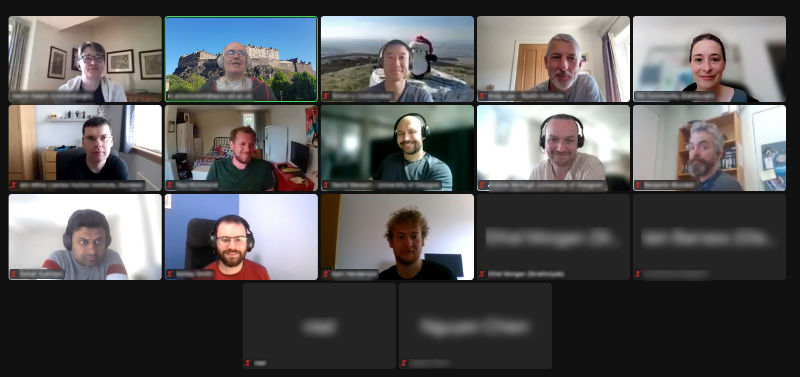

## ScotRSE:  A Network of Research Software Engineers in Scotland

These pages provide a hub for existing Scottish RSE groups, motivate new groups to form in Scottish Institutions and an opportunity to network between these groups or an individuals if there are no local groups. 

## Meetings

### University of Glasgow
Ian Barass: University of Glasgow

### Christmas Meetup 
Informal pre-christmas chat 

### James Hutton Institute
Fraser Macfarlane:  Machine Learning and its Application to Computer Vision Challenges at the James Hutton Institute
Becky Smith:  Introduction to the James Hutton Institute

### University of Strathclyde
Oliver Henrich: The Kokkos Ecosystem for Performance Portability
Daniel Thomas: Intro to the "Hacky Hour" drop in sessions that provide research software support and advice to researchers. 

### University of St Andrews 
Olexandr Konovalov: The St Andrews RSE team
Becky Smith: Volunteering at RSECon

### Inaugural meeting
Our very first ScotRSE event took place virtually on **Wednesday 14th June 10-11** online.

This first event provided an informal opportunity for various RSEs to get to know each other a little and to think about community building and how they would like to see the community evolving.

## Keep in touch!

If you are interested in finding out more please join our mailing list [SCOTRSE](https://www.jiscmail.ac.uk/cgi-bin/webadmin?A0=SCOTRSE) and see the #Scotland channel on UKRSE slack.

## Existing Scottish RSE Groups (that we know of...)

* [Community of Edinburgh RSEs (CERSE)](https://cerse.github.io)
* [University of Edinburgh - EPCC](https://www.epcc.ed.ac.uk)
* [University of St Andrews RSE group](https://rse.cs.st-andrews.ac.uk/)
* [University of Strathclyde RSE group](https://www.strath.ac.uk/science/computerinformationsciences/hackyhour/)
* [James Hutton Institute](https://www.hutton.ac.uk/)

If you know of other groups to add to the list please let us know.
